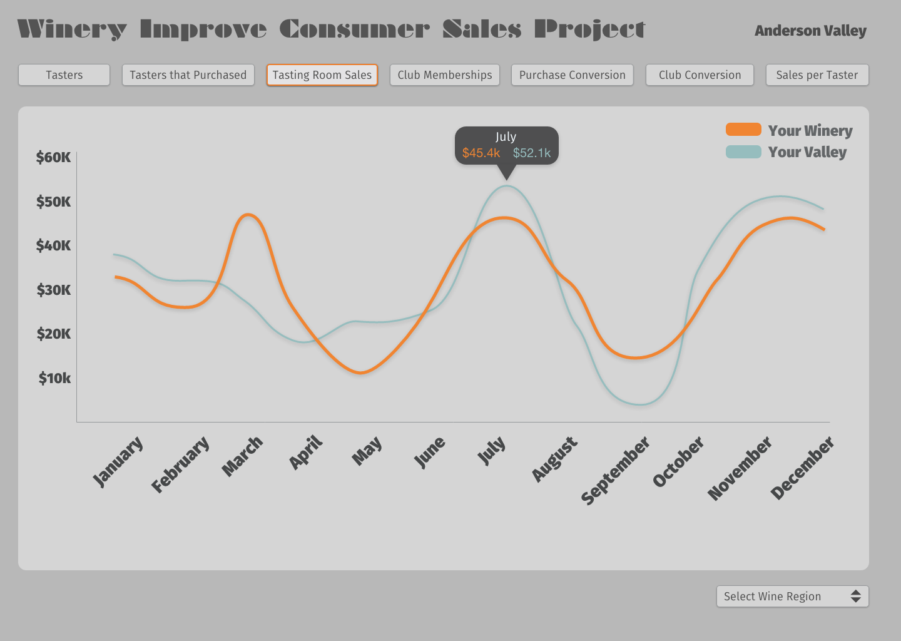
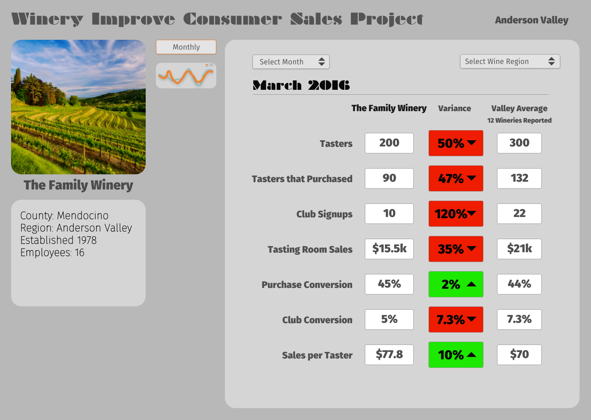

# TODO

* ~~create new Winery-Sales application framework~~
* setup app basics. gems and database
* ~~create github repository and upload to github~~

## Phase 1
* #### Winery
 * Model
    1. name **string**
    1. county **reference**
    1. region **reference**
    1. year established **number**
    1. number of employees **number**
    1. image **refile attachment**
    1. estate **boolean**
    1. array of dates for reminder emails **pg array or json**
 * Controller
 * View
    * Profile => (The Main View when logged in)    

* #### Sales Numbers
  * Model
     1. number of tasters **number**
     1. number of tasters that purchased **number**
     1. number of club signups **number**
     1. tasting sales **floating point**
     1. month **nunber** could be nill if using start and end date
     1. start date **datetime** could be nill if using monthly entry
     1. end date **datetime** could be nill if event or monthly entry
     1. was this an event or not **boolean**     
  * Controller
  * View

* #### User Accounts
  * name
  * email
  * password
  * has many wineries through winery_users
  * picture **refile attachment**  
  * permissions **number**
    * Guest 0
    * User 3
    * Admin 8
    * Root 11
  1. #### Actions for the Users
    1. Agree to terms
    1. email a login link.
    1. email a password reset
    1. email a verification    

* #### Winery-Users
  * reference winery
  * reference user
  * permissions level **number**

* #### Administrator Models & Resources
  * County
      1. name **string**
      1. population **number**
      1. image **refile attachment**
  * Region
      1. name **string**
      1. belongs_to: county
      1. image **refile attachment**
  * Email reminders

## Phase 2
* #### Tracking
  * user login
    * user id
    * created_at **datetime**
    * last access
    * last page time

  ---

### Design Screens

